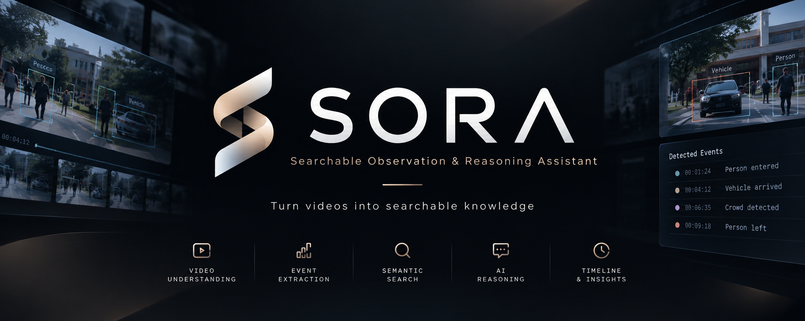

# SORA — Searchable Observation & Reasoning Assistant

> **An AI-powered video intelligence platform that turns long-form video into structured, searchable, and explainable events.**

**SORA** stands for **Searchable Observation & Reasoning Assistant**.

<p align="center">
  
</p>


> **Turn long-form video into structured, searchable, and explainable
> events.**

Sora is an AI-powered video intelligence platform that analyzes uploaded
videos, extracts meaningful events, builds a searchable event timeline,
and allows users to ask natural-language questions about what happened.

Instead of treating a video as thousands of independent frames, Sora
converts visual observations into higher-level events that can be
searched, summarized, and connected back to the original video as
evidence.

------------------------------------------------------------------------

## Overview

Traditional computer-vision applications often stop at object detection:

``` text
Video → Frames → Object Detection → Bounding Boxes
```

Sora goes one step further:

``` text
Video
  ↓
Frame Processing
  ↓
Object Detection
  ↓
Object Tracking
  ↓
Temporal Analysis
  ↓
Event Extraction
  ↓
Event Database
  ↓
Semantic Search / AI Reasoning
  ↓
Evidence-backed Answers
```

For example, instead of returning:

``` text
10:42:13 → Person detected
10:42:14 → Person detected
10:42:15 → Person detected
...
```

Sora can represent the observation as:

``` text
10:42:13 – 10:42:26

A person approached a bicycle.

Objects:
- Person
- Bicycle
```

This makes long videos easier to understand, search, and investigate.

------------------------------------------------------------------------

## Key Features

### 1. Video Upload

Upload a video and send it through the Sora processing pipeline.

Supported formats will initially focus on common video formats such as:

-   `.mp4`
-   `.mov`

### 2. Object Detection

Sora uses computer-vision models to identify relevant objects such as:

-   Person
-   Car
-   Motorcycle
-   Bicycle
-   Bus
-   Truck
-   Bag

The exact detection classes depend on the selected model and use case.

### 3. Object Tracking

Detected objects are tracked across consecutive frames to understand
movement over time.

Tracking allows Sora to distinguish between:

``` text
Person appears
      ↓
Person moves
      ↓
Person approaches object
      ↓
Person leaves
```

rather than treating every frame independently.

### 4. Event Extraction

Sora converts low-level detections into higher-level events.

Initial event types may include:

-   Person enters a region
-   Person leaves a region
-   Vehicle enters
-   Vehicle leaves
-   Object appears
-   Object disappears
-   Crowd formation
-   Crowd dispersal
-   Object remains stationary

### 5. Interactive Event Timeline

Every detected event is associated with a timestamp.

Users can browse events chronologically and jump directly to the
corresponding part of the video.

``` text
00:00 ────●────────●──────────●──────────●──── 20:00
          │        │          │          │
       Person    Vehicle     Crowd      Exit
```

### 6. Video Summary

Sora can generate a concise summary from the structured events extracted
from the video.

The goal is to summarize the evidence rather than blindly asking an LLM
to interpret the entire video.

### 7. Ask Sora

Users can ask natural-language questions about the processed video.

Examples:

> When did the first vehicle arrive?

> What happened near the entrance?

> How many people entered the area?

> When did the crowd form?

Sora retrieves relevant events and generates an answer using the
available evidence.

### 8. Evidence-backed Answers

Answers should be linked to the underlying video evidence whenever
possible.

Example:

``` text
Question:
When did someone approach the bicycle?

Answer:
A person approached the bicycle at approximately 10:42:13.

Evidence:
[10:42:13]
[10:42:19]
[10:42:26]
```

Selecting an evidence timestamp should take the user to the relevant
video segment.

------------------------------------------------------------------------

## Architecture

Sora is designed as a web application with a React frontend, Firebase
services, and a Python-based computer-vision/AI processing layer.

``` text
                    ┌─────────────────────┐
                    │      React UI       │
                    │                     │
                    │ Dashboard           │
                    │ Video Player        │
                    │ Event Timeline      │
                    │ Search / Q&A        │
                    └──────────┬──────────┘
                               │
                               ▼
                    ┌─────────────────────┐
                    │      Firebase       │
                    │                     │
                    │ Authentication      │
                    │ Firestore           │
                    │ Metadata / Events   │
                    └──────────┬──────────┘
                               │
                               ▼
                    ┌─────────────────────┐
                    │   Python AI Layer   │
                    │                     │
                    │ OpenCV              │
                    │ Object Detection    │
                    │ Tracking             │
                    │ Event Extraction    │
                    │ Embeddings          │
                    │ LLM Reasoning       │
                    └─────────────────────┘
```

### Processing Pipeline

``` text
                Uploaded Video
                      │
                      ▼
               Frame Sampling
                      │
                      ▼
              Object Detection
                      │
                      ▼
                  Tracking
                      │
                      ▼
             Temporal Processing
                      │
                      ▼
              Event Extraction
                      │
             ┌────────┴────────┐
             ▼                 ▼
       Structured Events    Embeddings
             │                 │
             │                 ▼
             │           Semantic Search
             │                 │
             └────────┬────────┘
                      ▼
                AI Reasoning
                      │
                      ▼
             Evidence-backed Answer
```

------------------------------------------------------------------------

## Technology Stack

### Frontend

-   React
-   JavaScript
-   CSS
-   Video playback components

### Backend / Cloud

-   Firebase
-   Firestore
-   Firebase Authentication
-   Firebase Cloud Functions where appropriate

### Computer Vision

-   Python
-   OpenCV
-   YOLO
-   Object tracking

### AI

-   Vision/LLM APIs or suitable open-source models
-   Embeddings
-   Vector search

The exact model choices may evolve during development based on
performance, cost, and hardware constraints.

------------------------------------------------------------------------

## Project Structure

The current repository provides the initial React and Firebase
foundation:

``` text
Sora/
├── functions/
│   └── src/
│       └── index.ts
│
├── public/
│
├── src/
│   ├── ...
│   └── App.js
│
├── firestore.indexes.json
├── firestore.rules
├── package.json
├── package-lock.json
└── README.md
```

As development progresses, the project will be organized around the
following logical components:

``` text
Frontend
    ├── Dashboard
    ├── Video Upload
    ├── Video Player
    ├── Event Timeline
    ├── Analytics
    └── Ask Sora

Backend
    ├── Authentication
    ├── Video Metadata
    ├── Event Storage
    └── Processing Status

AI / CV
    ├── Video Processing
    ├── Detection
    ├── Tracking
    ├── Event Extraction
    ├── Embeddings
    └── Reasoning
```

------------------------------------------------------------------------

## MVP Scope

The first version of Sora focuses on a working prototype rather than a
production-scale video platform.

### MVP

-   [ ] React dashboard
-   [ ] Video upload
-   [ ] Video processing pipeline
-   [ ] Frame extraction
-   [ ] Object detection
-   [ ] Basic object tracking
-   [ ] Rule-based event extraction
-   [ ] Event timeline
-   [ ] Event database
-   [ ] Video summary
-   [ ] Natural-language event search
-   [ ] Ask Sora
-   [ ] Evidence timestamps

### Intentionally Out of Scope for V1

To keep the project feasible and focused, the first version will not
prioritize:

-   Real-time CCTV streaming
-   Face recognition
-   Custom training of large foundation models
-   Video generation
-   Mobile applications
-   Payment/subscription systems
-   Kubernetes/microservice infrastructure
-   Large-scale distributed video processing
-   Complex action-recognition models

These can be considered future extensions if the core system is stable.

------------------------------------------------------------------------

## Example Workflow

### Step 1 --- Upload

``` text
User uploads campus_video.mp4
```

### Step 2 --- Process

``` text
Video
 ↓
Frame extraction
 ↓
YOLO detection
 ↓
Tracking
 ↓
Event extraction
```

### Step 3 --- Generate Events

``` text
10:02 — Person entered
10:07 — Vehicle arrived
10:12 — Person approached bicycle
10:16 — Crowd detected
10:21 — Vehicle departed
```

### Step 4 --- Search

``` text
User:
"Find events involving bicycles."

Sora:
10:12 — Person approached bicycle
14:27 — Bicycle entered the monitored region
```

### Step 5 --- Ask

``` text
User:
"When did the crowd form?"

Sora:
"A crowd was detected around 10:16."

[View evidence → 10:16]
```

------------------------------------------------------------------------

## Design Principles

### 1. Evidence over hallucination

The reasoning layer should work from extracted observations and
timestamps rather than relying solely on free-form model interpretation.

### 2. Events over frames

The system should transform thousands of low-level frame observations
into a small number of meaningful events.

### 3. Searchability

Video should become a queryable information source rather than something
users must watch from beginning to end.

### 4. Modular AI pipeline

Detection, tracking, event extraction, retrieval, and reasoning should
remain separate components so individual models can be replaced without
redesigning the entire application.

### 5. Prototype-first development

The goal is a working and demonstrable system, not a production-scale
surveillance platform.

------------------------------------------------------------------------

## Future Improvements

Potential future extensions include:

-   Advanced action recognition
-   Multi-camera event correlation
-   Audio/event fusion
-   Real-time video processing
-   Natural-language video navigation
-   Automatic anomaly detection
-   More advanced temporal reasoning
-   Multimodal search
-   Cross-video search
-   Event clustering
-   Confidence-aware answers
-   Human feedback for event correction

------------------------------------------------------------------------

## Project Goal

Sora aims to demonstrate how modern computer vision and AI reasoning can
transform unstructured video into structured, searchable information.

The central idea is:

> **Don't make users watch the entire video. Let Sora find what
> matters.**

------------------------------------------------------------------------

## Status

🚧 **Active Development**

The repository currently contains the initial React + Firebase project
foundation. The AI video intelligence pipeline and application features
are being developed incrementally.

------------------------------------------------------------------------

## License

License information will be added as the project matures.
